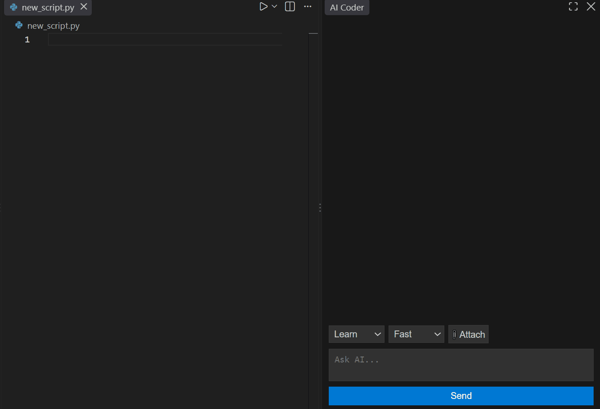
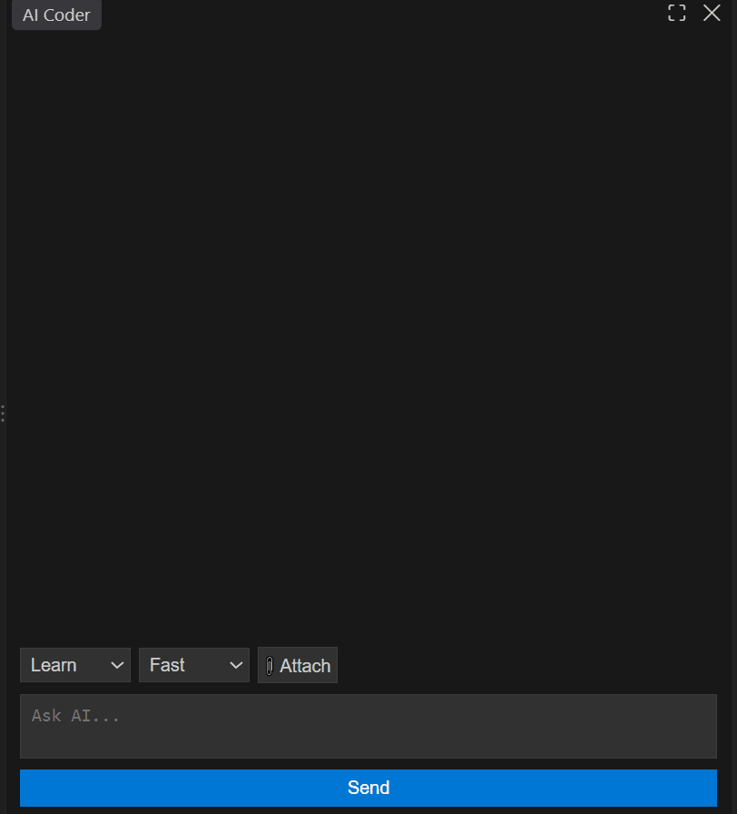
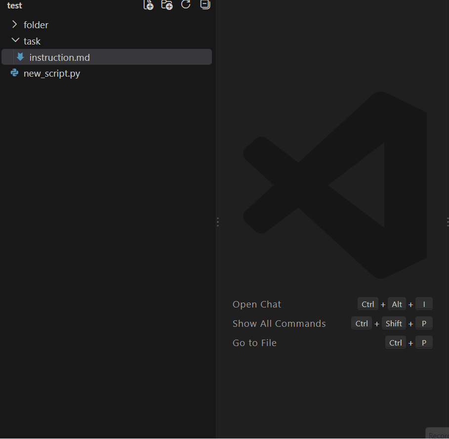
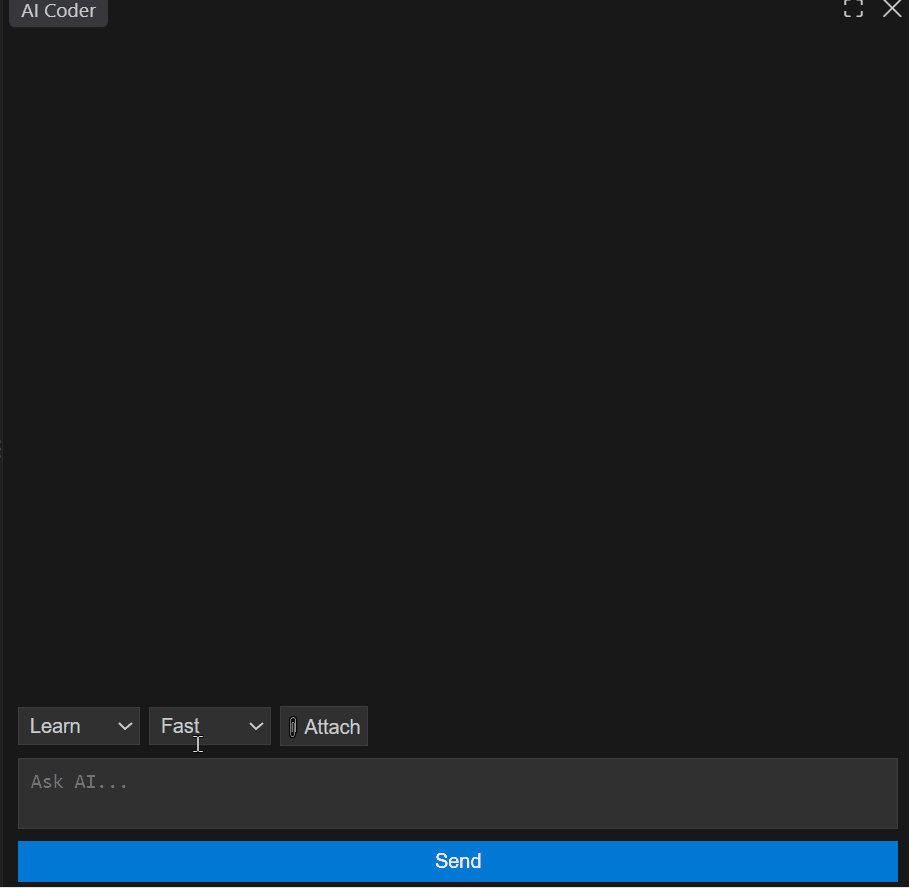

# Lightweight Coder Assistant

A lightweight, local AI programming assistant built as a VS Code extension. This project was developed as part of a diploma work at the West Pomeranian University of Technology (ZUT). It is specifically optimized for entry-level hardware, enabling high-performance agentic workflows using the Qwen 2.5 Coder 1.5B model on systems with limited resources.

## Project Essence

The assistant utilizes a quantized Qwen 2.5 Coder 1.5B model via llama.cpp to provide real-time chat, ghost text completions, and complex multi-stage reasoning locally. 

### Resource Optimization
* Target Hardware: 2GB VRAM and 8GB RAM.
* Inference Engine: Optimized via llama.cpp with a restricted context window (2048 n_ctx) and reduced batch size (128 n_batch) to ensure CUDA stability on low-VRAM GPUs.

## Key Features

### General Interface: Autocomplete and Chat

Demonstrates FIM autocomplete in the editor, the transition to the chat, the selection of Code Thinking mode, and the generation process.

### Agentic Thinking Workflow
The assistant implements a recursive Chain-of-Thought pipeline in its Thinking Mode:[cite: 1]
1. Goal Analysis: Deconstructs queries into a concise objective.[cite: 1]
2. Task Planning: Breaks complex coding tasks into logical steps.[cite: 1]
3. Iterative Critique: Automatically verifies responses for logic and syntax errors, with self-correction cycles (up to 3 attempts).[cite: 1]
4. Code Assembly: Refines fragments into a single, clean, and fully functional Python file.[cite: 1]

### Learn Mode and Generation Interruption

* The **Thinking** mode enforces concise and substantive answers (in contrast to the more verbose outputs of Fast mode).
* The **STOP** button allows for immediate interruption of the response stream at any given moment.

### Dynamic File Context Management

* Capable of solving programming tasks in **Code Fast** mode based solely on the content of the attached file.
* There is no need for additional problem description in the prompt – simply attaching the file with instructions is enough.
* The model deeply understands the context, even if the file name itself does not indicate its contents.

### Robust Streaming and completions
* JSON-stream buffering: The frontend manages fragmented chunks during generation to ensure smooth markdown rendering.[cite: 1]
* Ghost Text: Delivers non-intrusive inline code completions via a backend request queue, synchronized with hardware availability.[cite: 1]

### Safety and Concurrency
* Concurrency Management: An asyncio.Lock mechanism manages GPU access, preventing CUDA crashes during simultaneous requests from different extension components.[cite: 1]
* Human-in-the-Loop Terminal: Terminal commands are proposed through the UI and require explicit user approval before execution within the workspace directory.[cite: 1]

### Interactive Terminal

* Demonstrates the mechanism of rejecting (**Reject**) and accepting (**Accept**) potentially dangerous commands.
* Highlights the difference between **Fast** and **Thinking** modes (showing clearly visible command planning and analysis steps).
* Once accepted, the result of the system command execution is displayed directly within the chat window.

## Architecture

### Frontend (VS Code Extension - TypeScript)
* chat_view.ts: Manages the Webview UI and JSON-stream processing.
* ghost_text.ts: Provides inline code completions through the backend queue.
* Webview Script: Handles real-time markdown rendering and interactive command confirmation.

### Backend (FastAPI - Python)
* LLM Engine: A thread-safe wrapper for llama-cpp-python optimized for restricted memory environments.
* Orchestrator: Controls the reasoning cycles, self-critique logic, and intent detection.
* File Processor: Extracts and structures context from attached files for the model.

## Installation and Setup

### Prerequisites
* Python 3.10+
* VS Code
* Docker (for benchmarks)
* NVIDIA GPU with CUDA support

### Backend Setup
1. Navigate to the backend directory: `cd backend`
2. Install dependencies: `pip install -r requirements.txt`
3. Place the Qwen 2.5 Coder 1.5B GGUF model in the `models/` directory.
4. Start the server: `python main.py`

### Frontend Setup
1. Navigate to the frontend directory: `cd frontend`
2. Install dependencies: `npm install`
3. Launch the extension by pressing F5 in VS Code to open a new Development Host window.

## Testing and Benchmarks

The project includes an automated sandbox to verify reasoning quality and stability. All generated code is executed within isolated Docker containers to prevent unauthorized system access.

### Running Benchmarks
1. Start the backend and ensure Docker is running.
2. Navigate to the tests directory: `cd backend/tests`
3. Execute the benchmark script:

```bash
# Run all available tests
python run_benchmark.py

# Run a specific suite in Thinking mode
python run_benchmark.py L1_basic_algorithms -t "thinking"

# Limit the number of tests in Fast mode
python run_benchmark.py -n 5 -t "fast"
```

### Metrics and Validation
* Self-Correction Success Rate: Measures how often the model fixes its own errors.
* Warning Detection: Identifies cases where the internal verification fails after maximum retries.
* Performance: Logs processing time and token usage for hardware evaluation.

## Technical Solutions

| Constraint | Solution |
| :--- | :--- |
| 2GB VRAM Limit | Reduced n_ctx to 2048 and n_batch to 128 to prevent OOM errors. |
| Thread Safety | asyncio.to_thread and global asyncio.Lock within the Orchestrator. |
| Instruction Adherence | Strict token limits in planning and specialized stop-sequences. |
| Execution Safety | Docker-based isolation with disabled network access and memory limits. |
| Path Handling | Automated Windows-to-Linux path normalization for Docker execution. |
