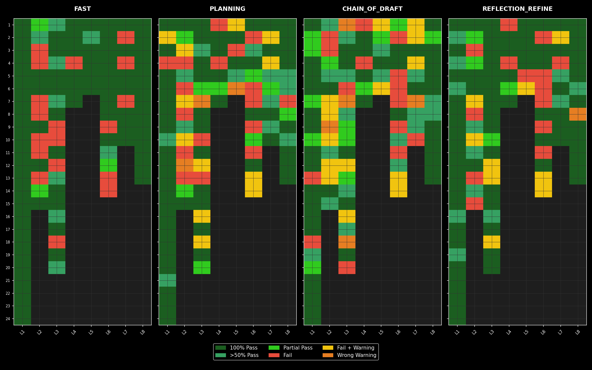
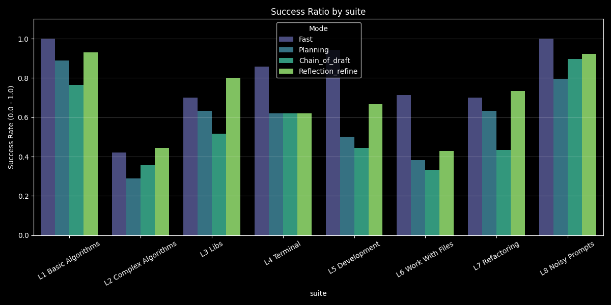
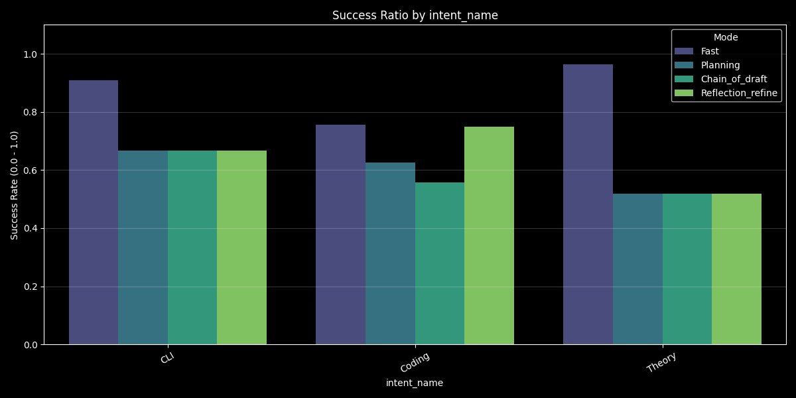
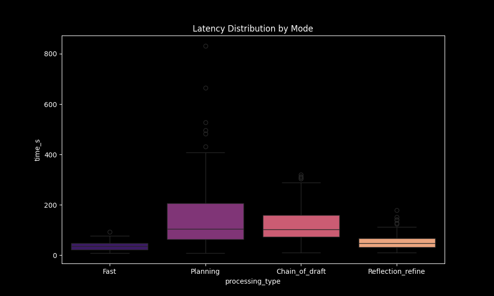
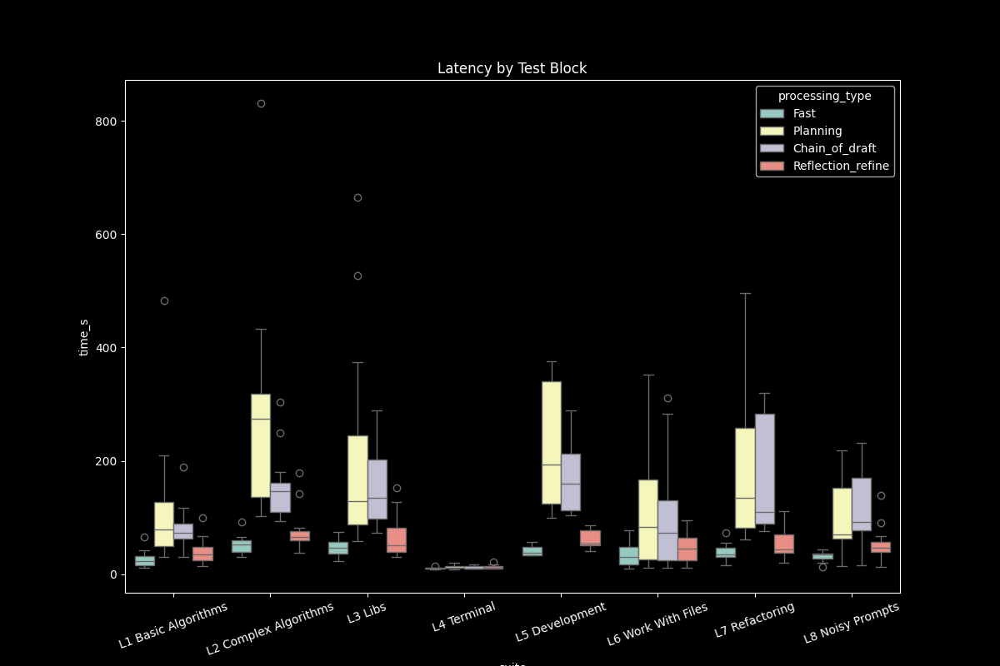
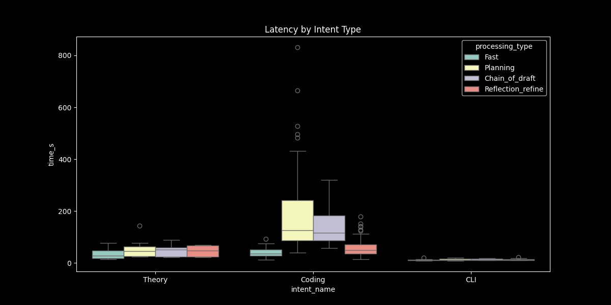
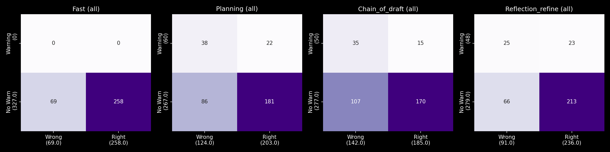
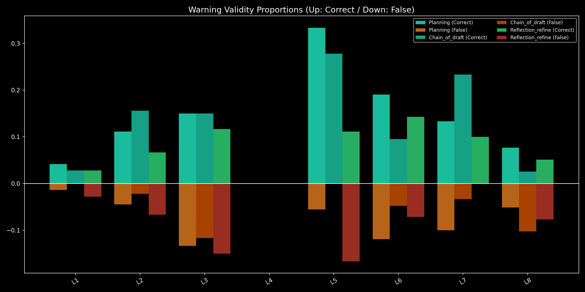
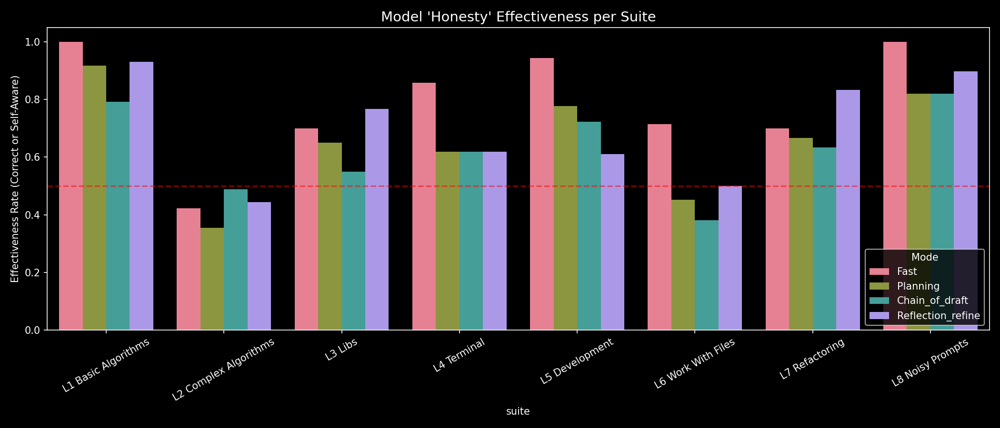

## 1. Zagregowane statystyki ogólne 

Zestawienie prezentuje skuteczność poszczególnych trybów, w tym wskaźnik sukcesu (procent poprawnych odpowiedzi) oraz statystyki mechanizmu ostrzeżeń (samokrytyki).

* **Tryb: Fast (Szybki)**
* **Testy:** 79 (100% poprawności) / 91 (Częściowo) / 109 (Wszystkie)
* **Wskaźnik sukcesu (Success Rate):** 78.9% (Całkowita liczba prób: 327)
* **Ostrzeżenia (Warnings):** 0 ogółem | Błędne ostrzeżenia: 0
* **Skuteczność ostrzeżeń (wykryte błędy):** 0.0%
* **Ingerencja (błędnie oflagowany sukces):** 0.0%

* **Tryb: Planning (Planowanie)**
* **Testy:** 55 (100% poprawności) / 80 (Częściowo) / 109 (Wszystkie)
* **Wskaźnik sukcesu (Success Rate):** 62.1% (Całkowita liczba prób: 327)
* **Ostrzeżenia (Warnings):** 60 ogółem | Błędne ostrzeżenia: 22
* **Skuteczność ostrzeżeń (wykryte błędy):** 48.4%
* **Ingerencja (błędnie oflagowany sukces):** 10.8%

* **Tryb: Chain_of_draft (Łańcuch szkiców)**
* **Testy:** 43 (100% poprawności) / 80 (Częściowo) / 109 (Wszystkie)
* **Wskaźnik sukcesu (Success Rate):** 56.6% (Całkowita liczba prób: 327)
* **Ostrzeżenia (Warnings):** 50 ogółem | Błędne ostrzeżenia: 15
* **Skuteczność ostrzeżeń (wykryte błędy):** 35.2%
* **Ingerencja (błędnie oflagowany sukces):** 8.1%

* **Tryb: Reflection_refine (Refleksja i poprawa)**
* **Testy:** 69 (100% poprawności) / 86 (Częściowo) / 109 (Wszystkie)
* **Wskaźnik sukcesu (Success Rate):** 72.2% (Całkowita liczba prób: 327)
* **Ostrzeżenia (Warnings):** 48 ogółem | Błędne ostrzeżenia: 23
* **Skuteczność ostrzeżeń (wykryte błędy):** 52.7%
* **Ingerencja (błędnie oflagowany sukces):** 9.7%

---

## 2. Analiza skuteczności ogólnej (Heatmaps)

Poniższe wykresy mapują ogólną skuteczność w poszczególnych testach, kategoryzując wyniki na pełen sukces (100%), częściowy (>50%) oraz niepowodzenie, a także prezentując ciągły rozkład proporcji sukcesu.

*Wykres 1: Kategoryczna siatka pokazująca poziomy zaliczenia testów (100%, >50%, Częściowe, Błąd) oraz znaczniki autokorekty. Zawiera oś Y z indeksami wszystkich testów.*

*Wykres 2: Ciągły gradient (Czerwony-Żółty-Zielony) mapujący dokładny współczynnik sukcesu. Tło maskuje nieistniejące testy.*

**Wnioski:**
Ogólny obraz na obu mapach ciepła wskazuje, że **tryb szybki (Fast) działa najlepiej**. Spośród architektur "myślących", tryb *Reflection refine* osiąga wyniki najbardziej zbliżone do trybu szybkiego i jest obiektywnie najlepszym z wariantów opartych na cyklu myślenia.

---

## 3. Skuteczność w podziale na bloki i typy zadań

Kolejne wykresy analizują wskaźnik sukcesu (w przedziale 0.0 - 1.0) w odniesieniu do konkretnych bloków tematycznych testów oraz złożoności zadań (teoria, kodowanie, CLI).

*Wykres 3: Porównanie współczynnika sukcesu pogrupowane według bloków testowych (np. Algorithms, CLI) przy zachowaniu stałej kolejności trybów.*

*Wykres 4: Porównanie współczynnika sukcesu z podziałem na stopień złożoności zapytania: Teoria (1), Kodowanie (2) oraz CLI (3).*

**Wnioski:**

* *Wykres 3:* Tryby *Planning* oraz *Chain of draft* ustępują trybowi szybkiemu we wszystkich blokach testowych. Z kolei tryb *Reflection refine* wykazuje lepsze rezultaty (przewyższające tryb szybki) **tylko w konkretnych blokach:** L2, L3 (tutaj odnotowano największą różnicę na korzyść trybu myślącego) oraz L7.
* *Wykres 4:* W ogólnym rozrachunku złożoności zadań, skuteczność trybu *Reflection refine* jest porównywalna z trybem szybkim.

---

## 4. Analiza czasu przetwarzania (Opóźnienia)

Rozkłady opóźnień pokazują narzut czasowy generowany przez tryby z cyklem myślenia oraz wskazują na ewentualne problemy sprzętowe (np. ograniczenia VRAM).

*Wykres 5: Wykresy pudełkowe (boxplots) pokazujące rozkład czasu przetwarzania (w sekundach) dla każdego z trybów.*

*Wykres 6: Segmentowane wykresy pudełkowe oceniające, jak różne bloki tematyczne wpływają na czas generowania odpowiedzi.*

*Wykres 7: Wykresy pudełkowe porównujące czas przetwarzania bezpośrednio w zadaniach Teoretycznych, Kodowania i CLI.*

**Wnioski:**
Wykresy wyraźnie obrazują **bardzo duże spowolnienie** w trybach myślących.
Tryb *Reflection refine* pozostaje najbliżej trybu szybkiego pod względem wydajności czasowej. Wynika to z faktu, że jest to architektura najprostsza – opiera się na ponownej próbie wygenerowania całości od nowa z uwzględnieniem samokrytyki. Bliskość wyników do trybu szybkiego tłumaczy fakt, że w większości przypadków model zatrzymywał się już po 1. próbie. Widoczne są jednak znaczne wartości szczytowe (outliery), które pojawiały się, gdy model kilkukrotnie próbował poprawić odpowiedź.

---

## 5. Ewaluacja mechanizmu samokrytyki (Ostrzeżeń)

Ostatnia sekcja raportu skupia się na tym, czy mechanizmy samooceny modeli potrafią trafnie ocenić jakość własnych odpowiedzi. *(Uwaga: Zgodnie z analizą, pominięto macierz wyłącznie dla kodowania, by uniknąć duplikacji wniosków).*

*Wykres 8: Macierz pomyłek (Confusion Matrix) ostrzeżeń dla wszystkich testów. Pokazuje wartości: True Positive (ostrzeżenie przy błędzie), True Negative (brak ostrzeżenia przy sukcesie), False Positive (ostrzeżenie mimo sukcesu) oraz False Negative (brak ostrzeżenia przy błędzie).*

**Wniosek do wykresu 8:** Mechanizm ostrzeżeń przepuszcza bardzo dużo błędów (wysoki odsetek False Negative), a jednocześnie nierzadko klasyfikuje poprawne odpowiedzi jako błędne (False Positive).

*Wykres 9: Dwukierunkowy wykres słupkowy. Oś Y skierowana w górę (kolory niebieski/zielony) pokazuje odsetek prawidłowych ostrzeżeń (zgłoszonych przy błędnej odpowiedzi). Oś Y skierowana w dół (kolory pomarańczowy/czerwony) pokazuje odsetek błędnych ostrzeżeń (zgłoszonych przy prawidłowej odpowiedzi) na dany blok testowy.*

**Wniosek do wykresu 9:**

* Ostrzeżenia okazują się w pełni efektywne dla: L1 (Chain of draft), L5 (Chain of draft) oraz L7 (Reflection refine).
* Dla bloku L4 ostrzeżenia w ogóle nie wystąpiły.
* W przypadku wybranych kombinacji testów i trybów odnotowano znacznie więcej prawidłowych ostrzeżeń niż błędnych, jednak dla wielu innych zestawień sytuacja była odwrotna (więcej fałszywych alarmów) lub proporcje te były równe.

*Wykres 10: Wykres "Uczciwości Modelu" (Model Honesty). Wskaźnik ten mierzy odsetek prób, gdzie ostateczny wniosek AI o własnej pracy był prawidłowy. Liczony jest jako: (Poprawne odpowiedzi bez ostrzeżenia + Błędne odpowiedzi z prawidłowym ostrzeżeniem) / Całkowita liczba prób. Dla trybu szybkiego jest to po prostu wskaźnik sukcesu (brak wbudowanej samokrytyki).*

**Wniosek do wykresu 10:**
Zestawienie to jest ostateczną weryfikacją skuteczności mechanizmu samokrytyki. W ogólnym ujęciu widać, że w większości przypadków **tryb szybki pozostaje najbardziej efektywny** (brak samokrytyki paradoksalnie daje pewniejszy rezultat). Niemniej jednak, dla specyficznych bloków zadaniowych, tryby myślące osiągnęły wyższą trafność oceny:

* Dla bloku **L2** najbardziej efektywny okazał się tryb *Chain of drafts*.
* Dla bloków **L3** i **L7** bardziej efektywny był tryb *Reflection refine*.