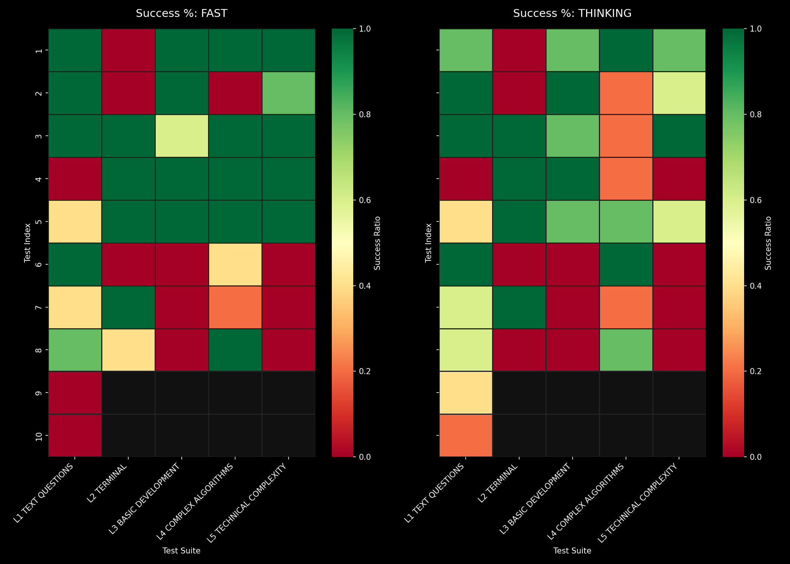
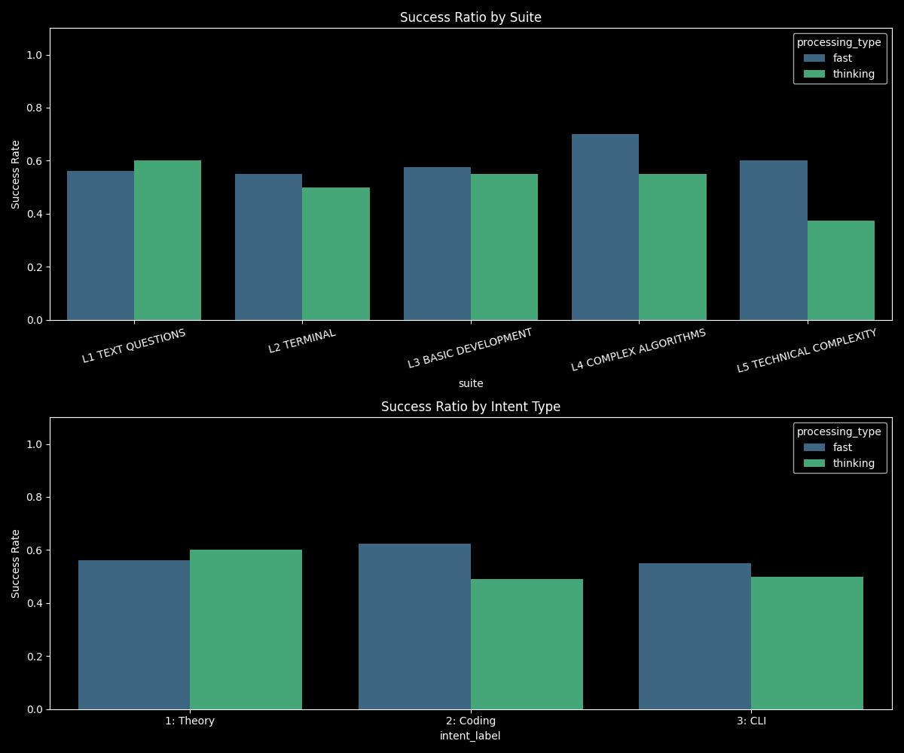
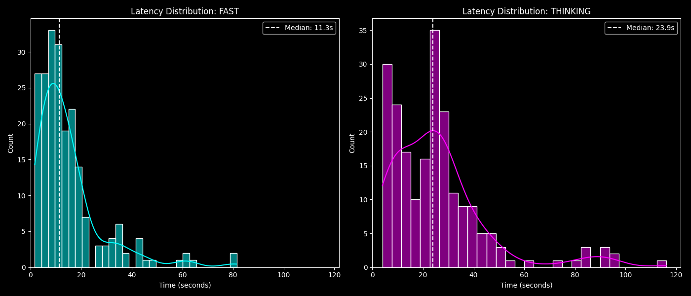
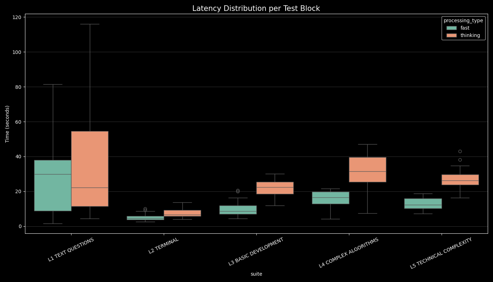

## 1. Zagregowane statystyki ogólne 
* **Tryb: FAST (Szybki)**
* **Całkowita liczba testów:** 42
* **Pełny sukces (Full Pass – wszystkie powtórzenia poprawne):** 21 (50.0%)
* **Częściowy sukces (Partial Pass – min. 1 powtórzenie poprawne):** 29 (69.0%)
* **Wskaźnik sukcesu dla pojedynczej próby:** 59.5% (125/210 prób)

* **Tryb: THINKING (Myślący)**
* **Całkowita liczba testów:** 42
* **Pełny sukces (Full Pass – wszystkie powtórzenia poprawne):** 12 (28.6%)
* **Częściowy sukces (Partial Pass – min. 1 powtórzenie poprawne):** 30 (71.4%)
* **Wskaźnik sukcesu dla pojedynczej próby:** 51.9% (109/210 prób)

**Wnioski:**
Tryb myślący wykazuje mniejszy determinizm i w ogólnym ujęciu częściej popełnia błędy (niższy wskaźnik *Full Pass* oraz niższa skuteczność na poziomie pojedynczych prób). Z drugiej strony wskaźnik *Partial Pass* jest wyższy. Oznacza to, że choć proces jest mniej stabilny, tryb myślący ma potencjał do rozwiązania **szerszego spektrum problemów** – w przypadku większej liczby zadań udało mu się wygenerować poprawną odpowiedź przynajmniej raz.

---

## 2. Analiza skuteczności na poziomie testów i kategorii

*Wykres 1: Podwójne mapy ciepła (heatmaps) odwzorowujące dokładne współczynniki sukcesu dla każdego testu. Czarne tło maskuje puste komórki, co pozwala na bezpośrednie wizualne porównanie niezawodności obu trybów.*

**Wniosek do wykresu 1:**
Analizując mapę ciepła, warto zwrócić szczególną uwagę na dwie ostatnie pozycje w 1. bloku testowym. Są to zadania o charakterze matematycznym i logicznym. To właśnie w tego typu problemach, wymagających dekompozycji i analitycznego podejścia, wdrożenie narzędzia "myślenia" jest najbardziej uzasadnione i przynosi najlepsze rezultaty.

*Wykres 2: Porównawcze wykresy słupkowe przedstawiające wskaźniki sukcesu (0.0–1.0) z podziałem na bloki tematyczne oraz stopień złożoności (Teoria, Kodowanie, CLI).*

**Wniosek do wykresu 2:**
Zestawienie to wyraźnie potwierdza, że tryb myślący radzi sobie zauważalnie lepiej w przypadku zadań teoretycznych (Theory) w porównaniu do trybu szybkiego.

---

## 3. Analiza czasu przetwarzania (Opóźnienia)

*Wykres 3: Histogramy rozkładu czasu przetwarzania (w sekundach) dla każdego trybu, wzbogacone o estymację gęstości (KDE) oraz wskaźniki mediany. Zobrazowany jest tu bezpośredni narzut czasowy generowany przez proces myślenia.*

*Wykres 4: Rozkład opóźnień przedstawiony za pomocą wykresów pudełkowych z podziałem na pakiety testowe, identyfikujący bloki tematyczne o największym obciążeniu.*

**Wniosek do wykresów 3 i 4:**
Zgodnie z oczekiwaniami, tryb myślący wymaga znacznie więcej czasu na przetworzenie odpowiedzi. Wynika to z dodatkowych kroków analitycznych i alokacji zasobów w procesie dekompozycji zadań, co wprost przekłada się na dłuższe czasy wykonania uwidocznione na wykresach.